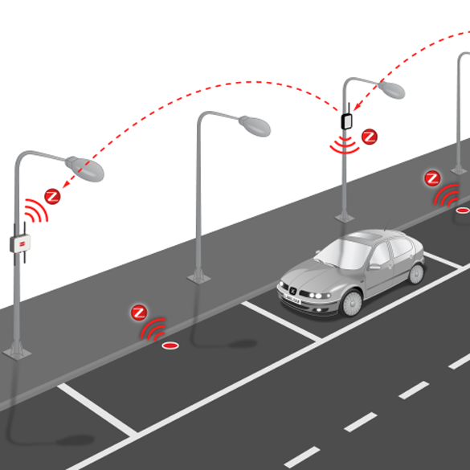
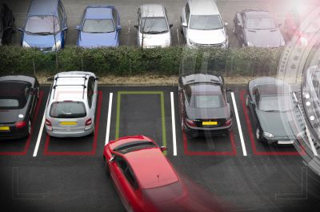

## Smart City Fast Parking Search Simulation

For the Fast Parking Search system I chose to use a Discrete-Event Based Simulation.

I chose this because a Discrete-Event Based Simulation changes it's behavior only when it is responding to a specific event. In this case a user input or a vehicle when it is parked over a sensor.

I would conduct the simulation with Anylogic because it is easy to use and has many resourses to get the results I want.

Some of the data I would like to collect is: 

- time it take to reach parking spot
- availablity of a parking spot
- traffic data around area of parkings

Inputs:

- user location
- sensor location

Outputs:

- parking spot number
- parking lot location
- time spent reaching parking spot
- traffic data

This system will help me analyse my hypothesis by acquiring data to show if a smart parking system actually helped with reduced time searching for parking and traffic.

The simulation will be conducted as following: User inputs a location to look for a parking spot. The location then outputs the closest parking lots near the user. User picks the parking lot they desire. The system then outputs the parking spot available to the user. The user sets course to their destination. The sensor starts a timer to capture the time it take to get to the parking spot. Data capturd will be time spent looking for a parking spot. Traffic systems will be able to analyze the amount of traffice in the nearby area where Fast Parking Search is installed. This way we can see if there is a decreas in traffic congestion and be able to prove my hypothesis.

