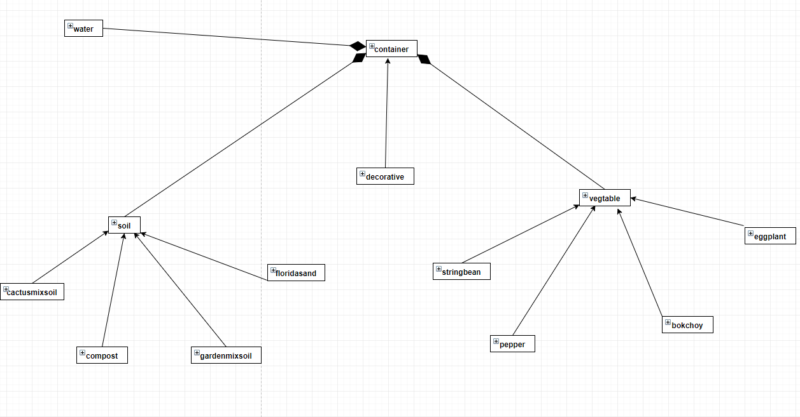

## **P**ortable **O**rganic **T**rouble-free **S**elf-watering System (**POTS**) Model

This is the models for the POTS system. The system is used to water vegtables by its self and keep track of it's health. If you don't take good care of your vegtables, they will die. Container class is what keeps everything together. Containers has soil, vegtables, and water. Soil has 4 different kinds of soil and each provide nutrients in different ways. Vegtable has 4 different vegtable. Each has their own way of growing and different volumes, but they all get the same sun, water, and death.

# POTS Object Diagram

# POTS Class Diagram

