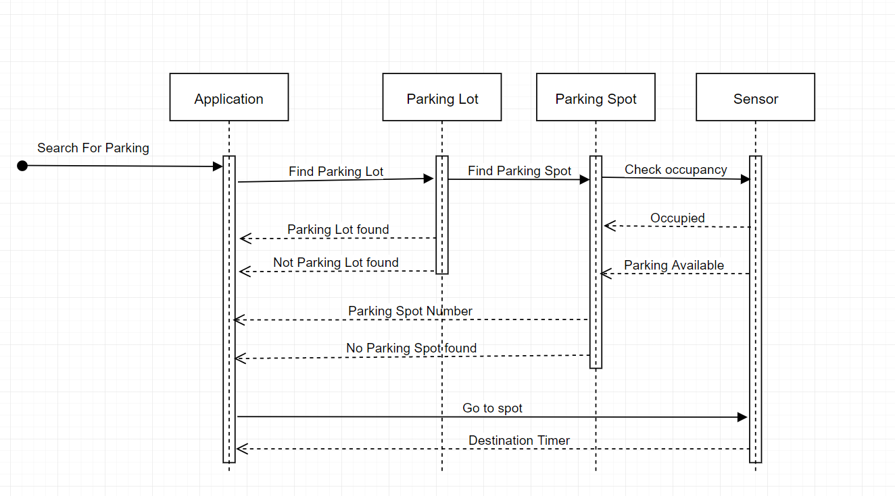

## Smart City Fast Parking Search Model - Behavior Diagram

(remove: provide a description of the current model you describe below)

This sequence diagram demonstrates the interactions between the different parts in the system. When a user starts a seach for a parking, they first have to goes through the Fast Search Parking App. 

