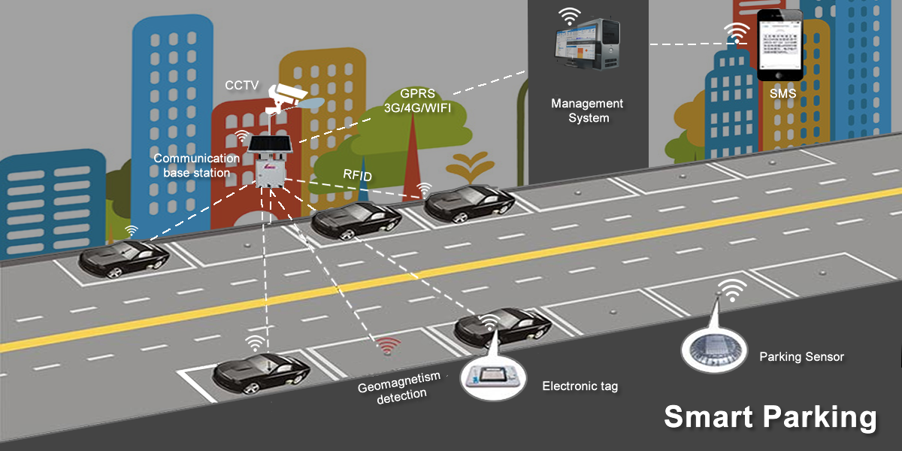

## Smart City Fast Parking Search Model - Class Diagram

This Class Diagram for the Fast Parking Search model describes what each class does for another. Parking lots is a base class which can be MulitLevel or Single Level. Every parking lot will contain a location so that the user can search for it. A location will contain a vector array that will eventually represent a location in the world. Parking lots will also have parkings spots. Parking spots can be of three types: Handicap, Regular, and Compact. They each have their only areas that can help determine what kind of spot it is. The Sensor class is a big part of the system. It will be able to keep track of occupancy and the parking spot number for the user to find their spot.

As in the picture above there is a cctv camera that can help track traffic around the area where the Fast Parking Search system is installed.