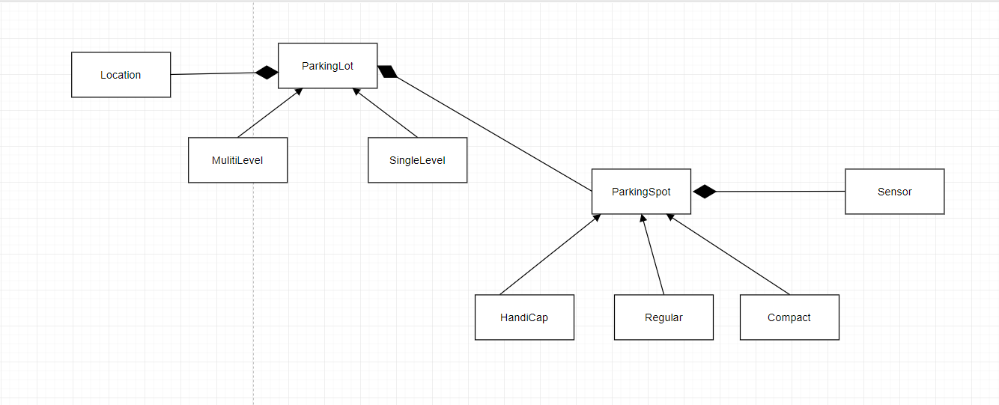

## Smart City Fast Parking Search Model - Object Diagram

(remove: provide a description of the current model you describe below)

This Object Diagram show at a high level how the Fast Parking Search model work and how every compoent works with each other. Each parking lot has a location that you can search for and it has sensor that let you know how far away you are from the sensor to help gather time data.

(remove: More decription)
(remove: Maybe a second or third diagram to highlight a point or aspect)

(remove: each diagram markdown file should roughly follow this template)